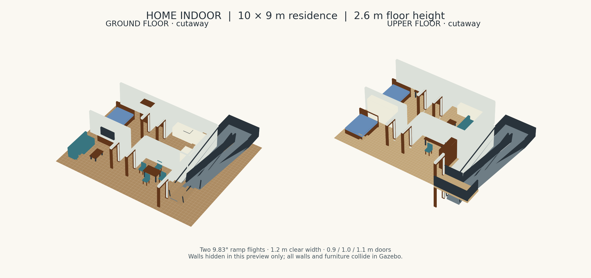

# 紧凑家庭双层场景 home_indoor

原创、无在线资源依赖的 Gazebo Fortress 室内场景。住宅主体每层 10 × 9 m，
两层地面分别为 z=0 / 2.6 m。保留接近普通住宅的家具尺寸、走廊和门洞；
侧边附设折返坡道供轮式机器人测试。顶层不封屋顶，便于查看。



[两层平面布置图](floor_plan.svg)。预览为几何示意图，隐藏了部分墙体；仿真保留全部碰撞。

## 启动

在工作空间 `/home/alioth/nature_will` 执行：

```bash
./src/scripts/simlation.bash omni home_indoor --check
./src/scripts/simlation.bash omni home_indoor
# 仅后台运行仿真和导航：
./src/scripts/simlation.bash omni home_indoor --headless --no-rviz
```

需要安装新增资源时：

```bash
source /opt/ros/humble/setup.bash
source install/setup.bash
colcon build --symlink-install --packages-select sentry_simulation
source install/setup.bash
ros2 launch sentry_simulation simulation.launch.py chassis_type:=omni world:=home_indoor
```

只查看场景（不启动机器人和导航）：

```bash
source /opt/ros/humble/setup.bash
source install/setup.bash
ign gazebo -r src/simulation/sentry_simulation/resource/worlds/home_indoor_world.sdf
```

默认出生点 `(5.0, 1.2, 0.02)`，朝向 +Y；地面落定后车轮贴合 z=0。
这个 world 没有配套 ICP PCD，因此按已有逻辑使用出生位置静态初始化。
原有 RMUC/RMUL 场景、默认 `rmuc_2026` 和导航参数不变。

## 布局和几何

| 项目 | 尺寸 / 内容 |
|---|---|
| 一楼 | 西南客厅、西北客房、东南餐厅、东北厨房 |
| 二楼 | 西南主卧、西北卧室、东南书房、东北休闲室 |
| 走廊 | X=4.2～5.8，两侧墙厚 0.18 m，净宽 1.42 m |
| 房间门洞 | 西侧净宽 0.9 m、东侧 1.0 m，净高 2.1 m |
| 坡道入口 | X=10、Y=0.8，净宽 1.1 m，无门槛 |
| 坡道 | 两段各水平长 7.5 m、升高 1.3 m；坡度 9.83°，净宽 1.2 m |
| 中间平台 | X=10.2～13.0、Y=9.1～10.7，顶面 z=1.3 m |
| 上层入口平台 | X=10～13.2、Y=0～1.6，顶面 z=2.6 m |
| 家具 | 沙发、茶几、电视柜、床/枕头、衣柜、餐桌椅、操作台、水槽、冰箱、书桌、书柜 |

房屋占地 90 m²/层，附设坡道后的整体地板约 13.6 × 11.2 m。
缓坡行程由层高决定，不是普通住宅中常见的楼梯尺寸。家具为轻量基础几何，
没有门扇开合或可移动家具；家具和门框均有实体碰撞，桌椅保留桌腿/椅腿结构。
174 个 box 和两个各 12 三角面的闭合坡道网格，无第三方贴图或模型下载。

坡道中心路线（世界坐标，z 为路面高度）：

```text
(10.8, 0.8, 0) → (10.8, 1.6, 0) → (10.8, 9.1, 1.3)
→ (10.8, 9.9, 1.3) → (12.4, 9.9, 1.3)
→ (12.4, 9.1, 1.3) → (12.4, 1.6, 2.6)
→ (12.4, 0.8, 2.6) → (9.0, 0.8, 2.6)
```

此路线适合分段检查或全向底盘手动通行。阿克曼底盘受最小转弯半径约束，
1.6 m 平台不保证能一次转过 180°，可能需要倒车调整。

实测当前 `sentry_omni` 在该坡面上以 0.6 m/s 纵向指令会停住，以 1.0 m/s
指令能够爬升到 z=2.6 m（实际爬坡速度低于指令速度）。其现有纵向速度控制是
增益 100、无积分的 P 控制；静止时 0.6 m/s 指令提供约 60 N，而约 38 kg 车体
在 9.83° 坡上的重力分量约 64 N。本场景没有修改底盘控制器。
上坡速度、坡上停车/下滑需单独测试，不能把低速停滞当作坡道存在台阶。

## 地图与导航边界

- `maps/home_indoor.yaml/.pgm`：默认一楼静态地图。
- `maps/home_indoor_upper.yaml/.pgm`：二楼独立静态地图。
- 分辨率 0.05 m，原点 `[0,0,0]`，尺寸 268 × 220；坡道变化高度区域保持 unknown。
- 地图由与碰撞体相同的几何生成，取各楼面上方 0.05～1.2 m 障碍物高度并集。
  桌腿、座面等在这一高度内会占据栅格；门楣和上一层楼板不会错误封住一楼。
- 二楼地图的 YAML 原点 z 仍为 0：标准二维 map_server 不表示楼层高度。
  上下楼同一 XY 存在两层地面，不能把两张地图叠成一张平面地图来规划。
- 当前 launch 仍加载一楼地图；本次没有增加楼层切换器或跨楼层全局规划。
  三维坡面碰撞可用于车辆/感知/地形测试，不能据此宣称已实现自动跨楼层导航。

## 修改和复现

`generate_scene.py` 是本场景唯一几何源，使用 Python 标准库。编辑后从工作空间根目录执行：

```bash
python3 src/simulation/sentry_simulation/resource/models/home_indoor/generate_scene.py
python3 -m pytest src/simulation/sentry_simulation/test/test_home_indoor.py -q
SDF_PATH="$PWD/src/simulation/sentry_simulation/resource/models" \
  ign sdf -k src/simulation/sentry_simulation/resource/worlds/home_indoor_world.sdf
```

脚本重新生成 `model.sdf`、`model.config`、两段 STL、world、两层 PGM/YAML 和平面 SVG；
`preview.png` 是交付时的示意快照，不随脚本自动更新。勿只修改生成文件。
修改完成后重新构建以让直接 `ros2 launch` 安装路径包含新资源。

## 调研来源

- [AWS RoboMaker Small House](https://github.com/aws-robotics/aws-robomaker-small-house-world)：
  提供房间/家具场景的参考方向；调研时仓库已归档。本场景未复制该仓库资产。
- [Fortress SDF worlds](https://gazebosim.org/docs/fortress/sdf_worlds/)：world、物理插件、模型与场景组织。
- [SDFormat geometry](https://sdformat.org/spec?ver=1.9&elem=geometry)：基础几何和网格定义。

本场景为原创资产，随本包 Apache-2.0 许可发布。
