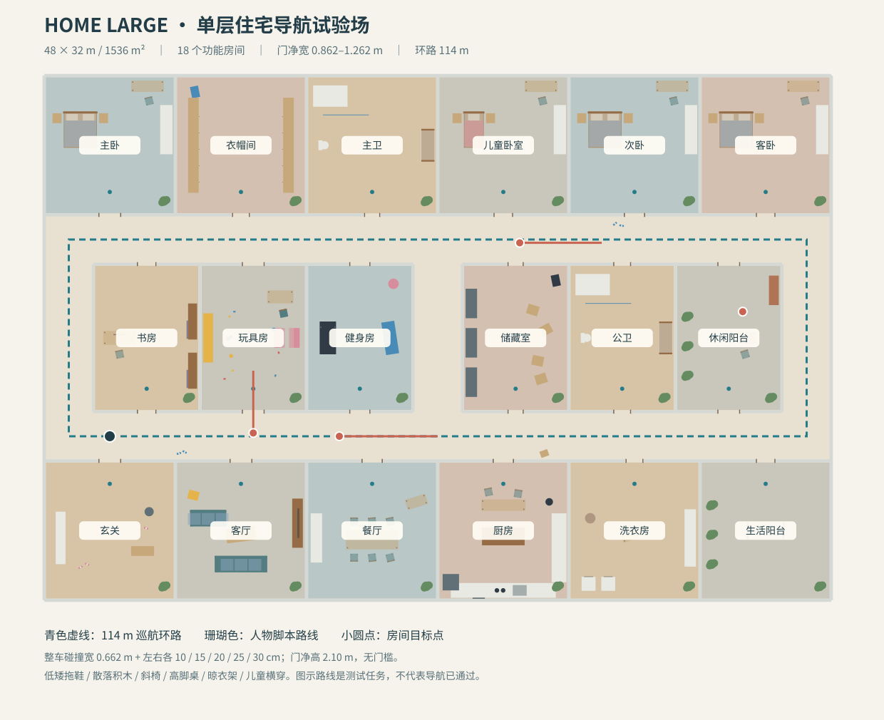

# home_large：大平层家居导航场景

48 × 32 m（1536 m²），单层、平地、无门槛；18 个功能房间、24 个带门框的 0.862 m 净宽门。保留原 `home_indoor` 双层住宅与所有默认场景。



## 启动

在 `/home/alioth/nature_will` 执行：

```bash
source /opt/ros/jazzy/setup.bash
source install/setup.bash
colcon build --base-paths src --packages-select sentry_simulation --symlink-install
source install/setup.bash
./src/scripts/simlation.bash swerve home_large --check
./src/scripts/simlation.bash swerve home_large
# 无界面、无 RViz：
./src/scripts/simlation.bash swerve home_large --headless --no-rviz
```

链路沿用四舵轮 / 四 Odin → odin_multi_fusion → Omni MINCO。入口默认值、导航参数、控制和噪声保持原设置。`--check` 仅验证依赖和导航配置；不代表导航运行通过。

只查看平台与场景：

```bash
ros2 launch sentry_simulation swerve_odin.launch.py world:=home_large
```

所有模型使用本地几何，无 Fuel 下载。`ScriptedObstacle` 插件随 `sentry_simulation` 构建安装，新增后需重新构建。

## 门宽和房间

`swerve_odin.yaml` 底盘宽为 0.604 m，左右 Odin 安装在 y = ±0.302 m，每侧沿横向伸出 0.029 m。整车碰撞宽度为 0.662 m，门框内缘距离为 **0.662 + 2 × 0.10 = 0.862 m**。净高 2.10 m、框体厚 0.24 m。此间隙以车头对准门洞、居中直行为条件；斜着穿门需要额外空间。尺寸由当前仿真碰撞模型计算，不是硬件实测。

- 南侧：玄关、客厅、餐厅、厨房、洗衣房、生活阳台。
- 北侧：主卧、衣帽间、主卫、儿童卧室、次卧、客卧。
- 中部：书房、玩具房、健身房、储藏室、公卫、休闲阳台。
- 走廊：南北两条 3 m 宽通道，两端连通形成环路；中央有横向连通的南北通道。

家具包括床、床头柜、衣柜、沙发、电视、橱柜、中岛、餐桌、高脚桌、不同朝向的椅子、洗衣机、浴缸、洗手台、晾衣架、书柜、纸箱、童车和盆栽。散落物包括 3 cm 鞋底的拖鞋、约 9–15 cm 积木、球、玩具车、低矮垫子。桌腿和悬空桌面分别建模；薄腿保留真实几何，地图栅格化时保守覆盖，避免消失。

`model.sdf` 中除了薄层地面饰面，每个静态物体都有对应的 visual 和 collision。人物模型也有头、躯干、手臂、腿和脚的独立碰撞体。几何为原创简化模型，适合导航障碍测试，不是照片级室内渲染。无天花板便于俯视；所有可行走地面均在 z=0。

## 人物运动

三个人物默认运动：南走廊成人约 0.75 m/s、北走廊成人约 0.71 m/s、玩具房儿童约 0.42 m/s；另有休闲阳台站立成人。轨迹和速度由 `manifest.json` 的仿真时间路点定义，端点停留并转向后返回。

暂停全部人物（机器人和世界继续运行）：

```bash
gz topic -t /home_large/people/enabled -m gz.msgs.Boolean -p 'data: false'
```

恢复：

```bash
gz topic -t /home_large/people/enabled -m gz.msgs.Boolean -p 'data: true'
```

插件冻结轨迹相位，恢复从当前位置继续；Gazebo 暂停也会冻结轨迹。重载世界可复现初始人物位置。人物是不可推动的脚本碰撞代理：物理接触面随其位姿移动，但不模拟人体受力、步态动画、主动避让或真实推挤动力学。Gazebo 普通 Actor 无物理碰撞，因此本场景没有仅依赖 Actor 动画来代表可碰撞障碍。[官方说明](https://gazebosim.org/docs/harmonic/actors/)

## 地图和测试目标

- `maps/home_large.yaml/.pgm`：0.05 m 栅格，地图外边界为 unknown。对 z=0.005–0.40 m 的静态几何取保守投影，适用于当前低矮四舵轮；低障碍保留，高脚桌下方不填成实心箱体。更高机器人需重新确定地图投影高度。
- 所有人物均不烘焙到静态地图，依赖在线感知；静态地图不能代替实时三维碰撞检查。
- `manifest.json`：房间边界、房间内部目标点、门位置/净宽、人物轨迹及巡航路点，坐标单位 m，世界/地图原点一致。
- 出生点：(4, 10)，yaw=0。
- 114 m 环路：(4,10) → (46.5,10) → (46.5,22) → (1.5,22) → (1.5,10) → (4,10)。这是指定的多目标巡航任务；单次远目标可能选中央捷径。
- 连续过门可选择中央房间南门→房间内部→北门。门内外先对齐车头，分别测试正向和反向通行。

测试建议先暂停人物验证窄门与低障碍，再恢复人物验证横穿、临时阻挡和地图清除。几何连通性、世界加载、人物插件测试与完整闭环导航是不同证据等级，不保证当前导航参数一定能通过全部困难点。

## 重新生成

```bash
python3 src/simulation/sentry_simulation/resource/models/home_large/generate_scene.py
python3 -m pytest src/simulation/sentry_simulation/test/test_home_large.py -q
```

生成器依赖 Python、numpy 和 PyYAML。重复生成确定性地覆盖本场景的模型、世界、地图、manifest 和 SVG。本场景不会修改机器人、现有场景或导航配置。
